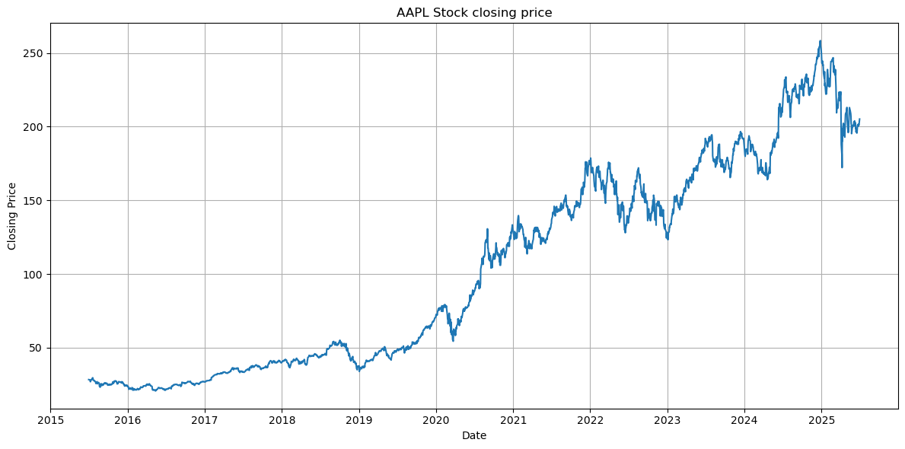
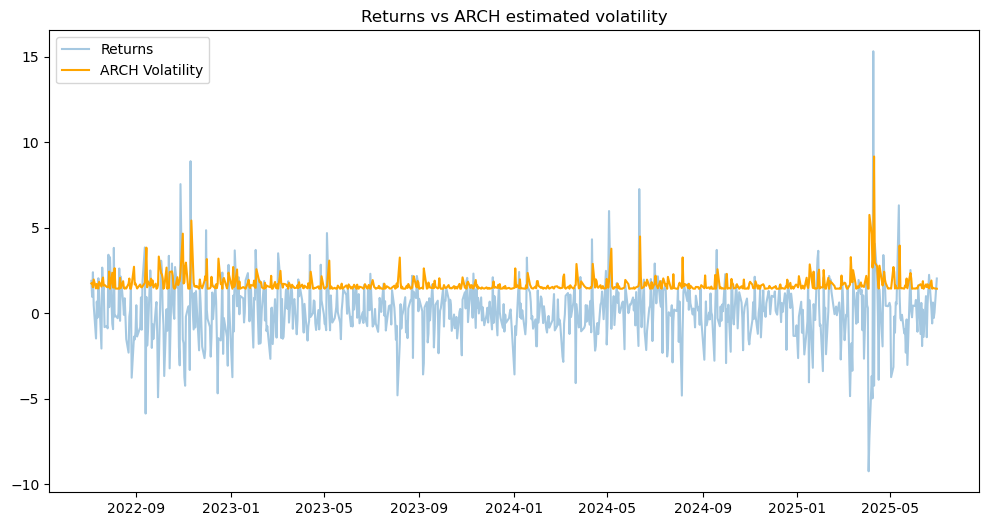
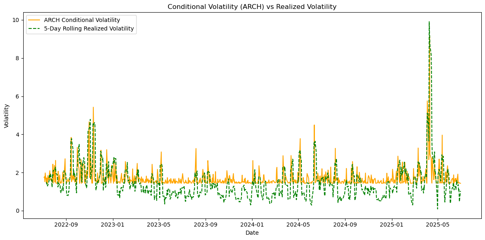
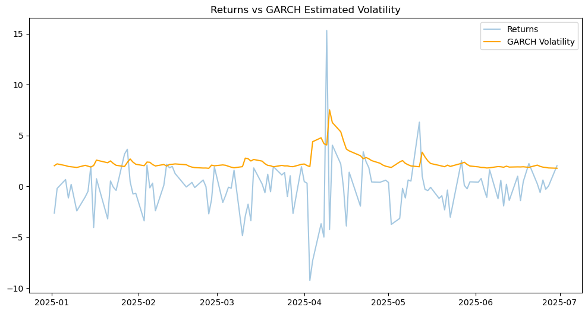
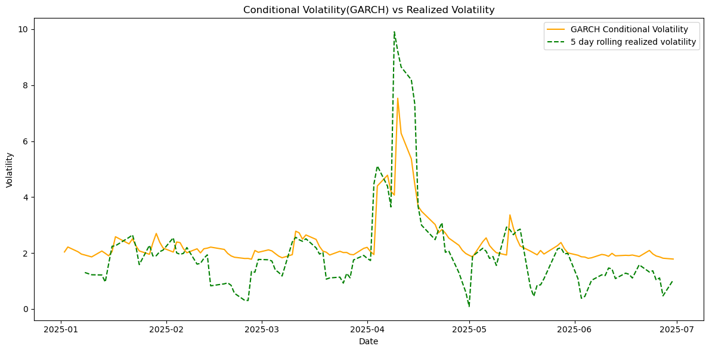

# Volatility Modeling using ARCH(1) & GARCH(1,1)

## Overview
This project explores volatility estimation and forecasting in financial markets using **Autoregressive Conditional Heteroskedasticity (ARCH)** and **Generalized ARCH (GARCH)** models. It applies these models to Apple Inc. (AAPL) stock data to capture and analyze volatility clustering patterns and compare predicted volatility with realized market behavior.

## Key Features
- Analyzed AAPL historical data from 2015 to 2025.  
- Computed daily log returns and identified volatility clustering.  
- Built and compared **ARCH(1)** and **GARCH(1,1)** models.  
- Forecasted **5-day rolling volatility** and compared it with realized volatility.  
- Visualized conditional volatility patterns and rolling volatility comparisons.

## Methodology
1. Collected historical stock price data.  
2. Processed data to calculate daily returns.  
3. Fitted ARCH(1) and GARCH(1,1) models to estimate conditional volatility.  
4. Compared model forecasts with realized volatility for evaluation.  
5. Visualized volatility clustering and trends for interpretability.

## Tools & Libraries
- Python for data analysis and modeling  
- numpy, pandas for data manipulation  
- yfinance for financial data retrieval  
- matplotlib for visualizations  
- arch for volatility modeling

## Results
### Historical Stock Prices  

### Returns Series and Volatility Clustering  

### ARCH(1) Model Conditional Volatility  

### GARCH(1,1) Model Conditional Volatility  

### Predicted vs Realized Volatility (5-day Rolling)  

## Future Improvements
- Implement additional GARCH-family models such as **EGARCH** and **GJR-GARCH**.  
- Extend analysis to multiple assets and asset classes.  
- Incorporate model selection criteria like **AIC** and **BIC** for optimization.
